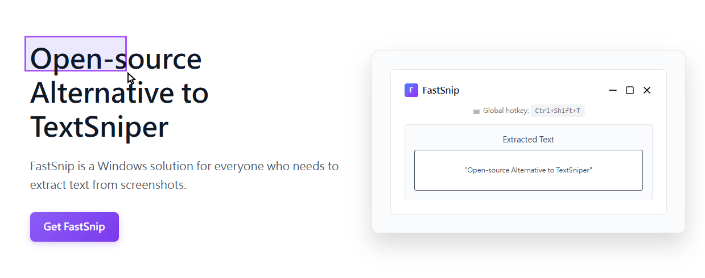

# FastSnip

[](https://louisho5.github.io/fastsnip/)

      [](https://louisho5.github.io/fastsnip/)  [](https://louisho5.github.io/fastsnip/)

A simple, free and open source OCR screen capture tool for Windows. It allows users to grab text from anywhere on the screen with a quick hotkey.

[Download FastSnip](https://louisho5.github.io/fastsnip/)

## Why I built this

I was looking for something like TextSniper (which is Mac-only) for Windows but couldn't find any good alternatives. So I decided to build one myself for everyone who needs it.

## What it does

- Press `Ctrl+Shift+T` to capture any area and extract text
- Works with multiple languages (English, Chinese, Japanese, Korean, etc.)
- Sits in your system tray, stays out of the way
- Copy extracted text with one click
- No installation needed - just download and run

## How to use it

1. Download and run `FastSnip.exe` 
2. Press `Ctrl+Shift+T` anywhere to capture
3. Drag to select text area
4. Copy the extracted text

Right-click t

## Development

Want to build it yourself?

```bash
git clone https://github.com/louisho5/fastsnip.git
cd fastsnip
npm install
npm run dev
```

## License

This project is licensed under the MIT License - see the [LICENSE](LICENSE) file for details.

### Third-Party Licenses

This project uses the following third-party libraries:

**Electron**
- License: MIT License
- Source: https://github.com/electron/electron

**Tesseract.js**
- License: Apache License 2.0
- Source: https://github.com/naptha/tesseract.js

he system tray icon to change language settings.


## Changelog

<details open>
  <summary>Version 0.2.0</summary>

  Added support for automatic clipboard copying
</details>

<details open>
  <summary>Version 0.1.0</summary>

  Initial release
</details>